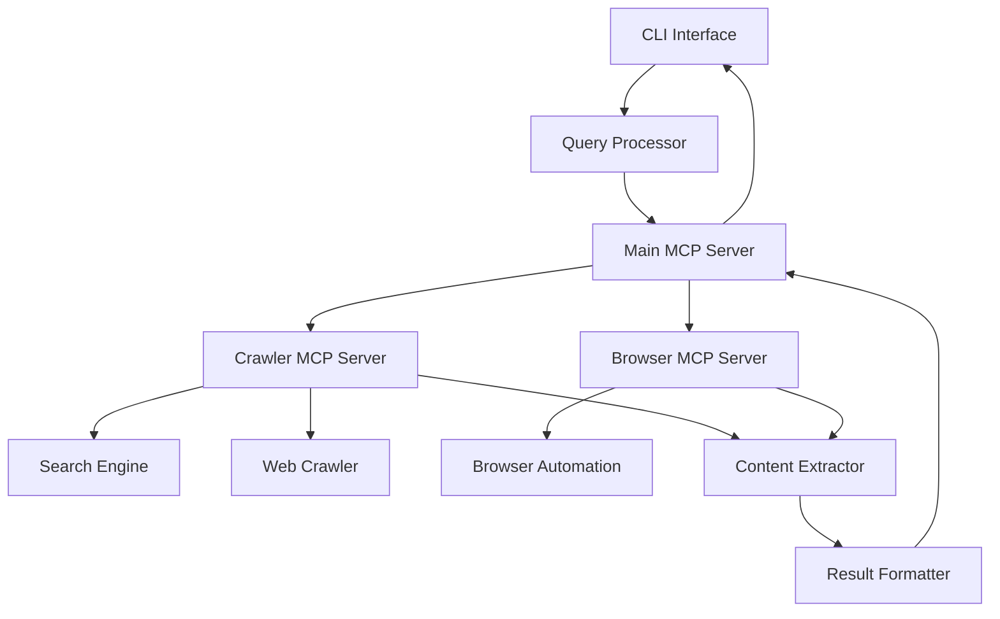

# AI Web Crawler CLI Tool

A command-line interface (CLI) tool that can search and crawl the web to find information based on natural language queries, returning AI-enhanced results in markdown format. Now with search API integration and AI-powered summarization!

## Features

- Natural language query processing
- Search API integration (Brave Search)
- AI-powered search enhancement and summarization (OpenRouter API)
- Web crawling with Puppeteer browser automation
- Content extraction and relevance filtering
- AI-enhanced result formatting with HTML rendering
- Screenshot capabilities
- Markdown-formatted results
- File output support
- MCP server architecture for extensibility

## Installation

```bash
# Clone the repository
git clone https://github.com/yourusername/ai-crawler.git
cd ai-crawler

# Install dependencies
npm install

# Build the project
npm run build

# Make MCP server scripts executable
chmod +x src/mcp/crawler-server.js src/mcp/browser-server.js
```

## API Keys Setup

To use the search API and AI summarization features, you need to set up the following API keys:

### Brave Search API

1. Create an account at [https://brave.com/search/api/](https://brave.com/search/api/)
2. Subscribe to the API plan that fits your needs
3. Generate an API key from your dashboard

### OpenAI/OpenRouter API (Optional)

1. Create an account at [https://platform.openai.com/](https://platform.openai.com/) or [https://openrouter.ai/](https://openrouter.ai/)
2. Navigate to the API keys section
3. Create a new API key (your OpenAI API key can be used with OpenRouter)

### Environment Variables Setup

The project includes an `.env.example` file that shows the required environment variables:

```
# Environment variables for AI Crawler
BRAVE_API_KEY=your_brave_api_key
# Add your OpenAI API key here if you have one
# OPENAI_API_KEY=your_openai_api_key
```

To set up your environment:

1. Copy the `.env.example` file to create a new `.env` file:
   ```bash
   cp .env.example .env
   ```

2. Edit the `.env` file with your actual API keys:
   ```bash
   # For Brave Search API (required)
   BRAVE_API_KEY=your_brave_api_key
   
   # For OpenAI/OpenRouter API (optional, enhances summarization and content formatting)
   OPENAI_API_KEY=your_api_key
   ```

The application will automatically load these variables from the `.env` file when it runs.

## Usage

### CLI Usage

```bash
# Basic usage
node build/index.js "your query here"

# Example queries
node build/index.js "what is the price of iPhone 16"
node build/index.js "what are the differences between Python and JavaScript"
node build/index.js "what is the weather in New York today"

# Save results to a file (generates both .md and .html files)
node build/index.js "your query here" --output results.md
# This will create both results.md and results.html, and open the HTML in your browser

# Enable verbose output
node build/index.js "your query here" --verbose

# Set crawling depth
node build/index.js "your query here" --depth 5

# Set request timeout
node build/index.js "your query here" --timeout 60

# Enable caching
node build/index.js "your query here" --cache

# Display help
node build/index.js --help
```

### MCP Server Usage

The project can also be used as an MCP server that provides AI-powered search and crawling capabilities:

```bash
# Run the main MCP server (will use API keys from .env file)
node build/index.js

# In another terminal, run the test script
node test-ai-search.js
```

This will demonstrate the AI-powered search and crawling capabilities using the MCP server architecture with search API and AI summarization.

### Testing Without API Keys

If you don't have API keys, the system will fall back to mock search results and basic summarization:

```bash
# Run the test script without API keys
node test-ai-search.js
```

## Options

### CLI Options

- `-o, --output <path>`: Output file path for the results
- `-v, --verbose`: Enable verbose output
- `-d, --depth <number>`: Maximum crawling depth (default: 3)
- `-t, --timeout <seconds>`: Request timeout in seconds (default: 30)
- `-c, --cache`: Enable result caching
- `-h, --help`: Display help information
- `-V, --version`: Output the version number

### MCP Tools

The MCP server provides the following tools:

- `search_web`: Search the web for information based on a query
- `crawl_page`: Crawl a specific web page and extract information

## Project Structure

```
ai-crawler/
├── build/                  # Compiled JavaScript files
├── src/                    # Source code
│   ├── cli/                # Command-line interface
│   ├── query/              # Query processing
│   ├── search/             # Search engine integration
│   ├── crawler/            # Web crawling functionality
│   ├── extractor/          # Content extraction
│   ├── formatter/          # Result formatting
│   ├── mcp/                # MCP server implementations
│   │   ├── index.js        # MCP client manager
│   │   ├── crawler-server.js # Crawler MCP server
│   │   └── browser-server.js # Browser MCP server
│   └── index.js            # Main MCP server entry point
├── test-ai-search.js       # Test script for AI search
├── memory-bank/            # Project documentation
├── package.json            # Project configuration
└── tsconfig.json           # TypeScript configuration
```

## Architecture

The project uses a multi-server architecture with specialized MCP servers for different tasks:



## Current Status

The project now has:
- ✅ Search API integration (Brave Search)
- ✅ AI-powered summarization and markdown formatting (OpenRouter API)
- ✅ MCP server architecture with specialized servers
- ✅ Puppeteer-based browser automation
- ✅ Content extraction and formatting

Future enhancements will include:
- Advanced content extraction techniques
- Comprehensive error handling and recovery
- Intelligent rate limiting and caching
- Support for multimedia content
- Additional search providers
- Custom extractors for popular websites

## License

ISC
