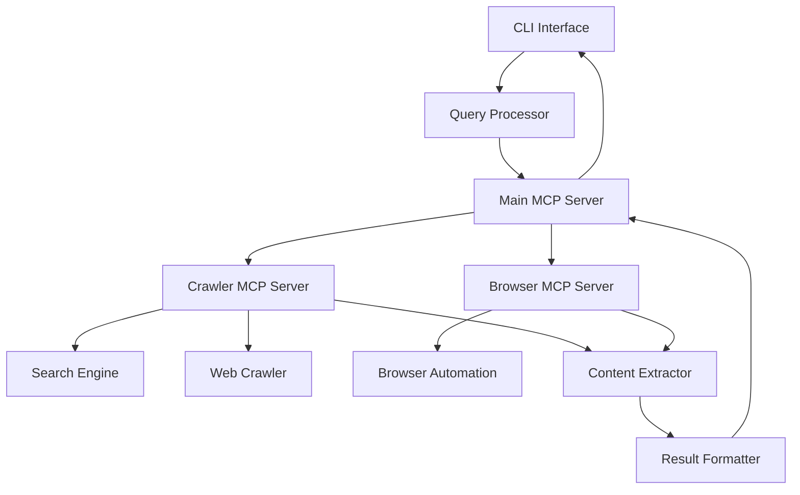
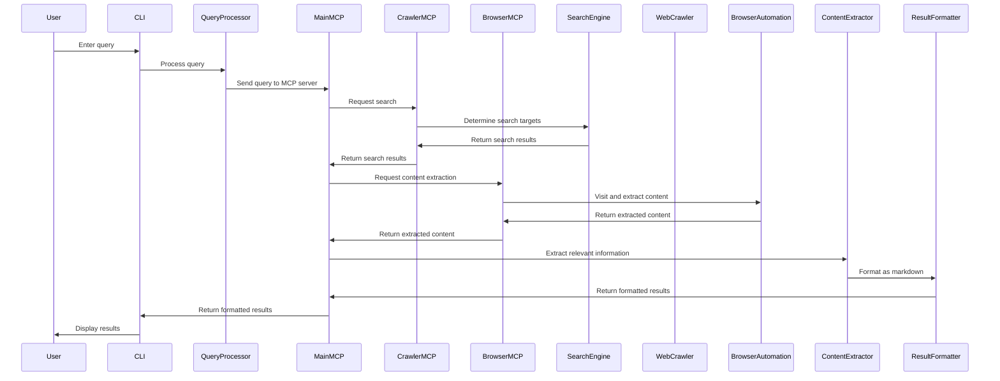

# System Patterns: AI Web Crawler CLI Tool

## System Architecture

The AI Web Crawler CLI tool follows a modular architecture with MCP servers for specialized tasks:

### Component Responsibilities

1. **CLI Interface**
   - Handles user input and output
   - Parses command-line arguments
   - Displays results to the user

2. **Query Processor**
   - Analyzes natural language queries
   - Identifies key search terms and intent
   - Determines the appropriate search strategy

3. **Main MCP Server**
   - Hosts AI-powered search and crawling tools
   - Manages connections to specialized MCP servers
   - Coordinates the overall search and extraction process
   - Provides a unified interface for the CLI

4. **Crawler MCP Server**
   - Handles web search operations
   - Manages web crawling functionality
   - Extracts content from web pages
   - Respects robots.txt and crawling policies

5. **Browser MCP Server**
   - Provides browser automation capabilities
   - Handles JavaScript-heavy websites
   - Takes screenshots of web pages
   - Extracts content from dynamic web pages

6. **Search Engine**
   - Identifies relevant websites to crawl
   - Prioritizes sources based on relevance
   - Manages search scope and depth

7. **Web Crawler**
   - Navigates to and retrieves web pages
   - Handles HTTP requests and responses
   - Manages rate limiting and retry logic

8. **Browser Automation**
   - Controls headless browser instances
   - Interacts with web pages (clicking, typing)
   - Handles JavaScript execution
   - Captures screenshots and extracts content

9. **Content Extractor**
   - Parses HTML content
   - Identifies and extracts relevant information
   - Filters out irrelevant content
   - Aggregates information from multiple sources

10. **Result Formatter**
    - Organizes extracted information
    - Formats results in markdown
    - Enhances results with AI-generated summaries
    - Ensures readability and consistency

## Design Patterns

### Core Patterns

1. **Command Pattern**
   - Used in the CLI interface to encapsulate different types of queries
   - Allows for extensibility with new query types

2. **Strategy Pattern**
   - Applied in the Search Engine to implement different search strategies
   - Enables switching between search approaches based on query type

3. **Factory Pattern**
   - Used to create appropriate crawler instances for different websites
   - Allows for specialized crawling behavior for specific domains

4. **Observer Pattern**
   - Implemented for monitoring crawling progress
   - Enables real-time feedback during long-running operations

5. **Adapter Pattern**
   - Used to normalize data from different websites
   - Ensures consistent data structure regardless of source

6. **Client-Server Pattern**
   - Implemented through MCP servers and clients
   - Enables separation of concerns and distributed processing

7. **Facade Pattern**
   - Main MCP server provides a simplified interface to complex subsystems
   - Hides the complexity of multiple specialized servers

### Technical Implementation

1. **MCP (Model Context Protocol) Architecture**
   - Multiple specialized MCP servers for different tasks
   - MCP client manager for connecting to multiple servers
   - Standardized communication protocol between servers

2. **AI Integration**
   - AI-powered search enhancement
   - Content relevance determination
   - Result summarization and formatting

3. **Puppeteer-based Web Crawling**
   - Uses headless browser for JavaScript-heavy websites
   - Enables interaction with dynamic web content
   - Isolated in a dedicated MCP server

4. **Modular Plugin System**
   - Allows for specialized extractors for different websites
   - Enables community contributions for specific domains

5. **Caching Layer**
   - Implements intelligent caching to reduce redundant requests
   - Improves performance for repeated or similar queries

## Data Flow

## Error Handling Strategy

1. **Strict API Requirements**
   - Require valid API keys for operation
   - Provide clear error messages when API keys are missing or invalid

2. **Comprehensive Logging**
   - Detailed logging of crawling and extraction processes
   - Helps with debugging and improving the system

3. **Rate Limiting Protection**
   - Intelligent backoff strategies when rate limits are encountered
   - Distributes requests across time to avoid blocking

4. **Timeout Management**
   - Sets appropriate timeouts for different operations
   - Prevents hanging on slow or unresponsive websites

5. **MCP Server Error Handling**
   - Handles communication errors between MCP servers
   - Manages server crashes and restarts
   - Ensures proper cleanup of resources

## Extensibility Points

1. **Custom Extractors**
   - Plugin system for site-specific content extraction
   - Allows for specialized handling of different websites

2. **Search Providers**
   - Pluggable search backends (Brave Search, Bing, DuckDuckGo, etc.)
   - Enables switching between different search engines

3. **Output Formats**
   - Extensible formatting system beyond markdown
   - Potential for JSON, CSV, or other structured outputs

4. **Query Enhancers**
   - Plugins to improve query understanding
   - Domain-specific query processing

5. **MCP Server Extensions**
   - Additional specialized MCP servers for specific tasks
   - Custom tools for different types of content or websites

6. **AI Model Integration**
   - Pluggable AI models for different tasks
   - Support for both local and cloud-based AI services
